# 개발 로드맵

이 문서는 Workshop Agent를 문서 완료 상태에서 실제 제품으로 구현하기 위한 전체 phase 계획이다. 각 phase는 주 모듈, 산출물, 선행 조건, 완료 게이트를 분리해 진행한다.

## 진행 원칙

1. 문서 변경이 필요한 기능은 코드보다 문서를 먼저 업데이트한다.
2. 한 phase는 하나의 주 모듈을 갖고, 협업 모듈은 명시적으로만 수정한다.
3. schema/type/Zod/API contract를 UI보다 먼저 고정한다.
4. 새 기능은 테스트를 먼저 작성한다.
5. 각 phase 완료 시 `lint -> typecheck -> test -> build`를 통과한다.
6. Foundation과 최종 통합 phase는 Docker build와 `/api/health` smoke까지 통과한다.

## 전체 Phase 맵

| Phase | 이름 | 주 모듈 | 기존 step | 목표 |
|-------|------|---------|-----------|------|
| P-0 | Documentation Readiness | M9 | 현재 문서 작업 | 개발 착수 전 문서/계약/로드맵 고정 |
| P0 | Platform Foundation | M0/M9 | step0 | Next.js 15, env, Supabase clients, Docker, CI 기준 생성 |
| P1 | Data Contract | M2/M9 | step1 | DB schema, RLS, Realtime publication, TypeScript DB 타입 |
| P2 | Identity & Entry | M1/M2/M8 | step2 | facilitator auth, project dashboard, invite join, signed cookie |
| P3 | Workshop Shell & Realtime | M2/M3/M8 | step3 | workshop layout, stores, subscriptions, stage shell |
| P4 | Board & Notes | M4/M3/M8 | step4 | tldraw/Yjs board, notes API, DB canonical sync |
| P5 | AI Clustering | M5/M4/M8 | step5 | Azure OpenAI cluster pipeline, cluster view, stale handling |
| P6 | Voting | M6/M2/M8 | step6 | dot voting, result visibility, participation summary |
| P7 | AX Design | M5/M7/M8 | step7 | TO-BE/Agent/KPI/tasks generation and reaction flow |
| P8 | PRD & Report Outputs | M7/M5/M8 | step8 | PRD/report generation, edit/preview/copy, Mermaid rendering |
| P9 | Stage Integration & MVP Gate | M2/M8/M9 | step9 | free navigation, stage guards, completed read-only, release gate |
| P10 | Stabilization | M9/all | Post-MVP hardening | E2E, load smoke, monitoring, defects, pilot readiness |
| P11 | Product Expansion | owning module | Post-MVP backlog | timer, manual cluster, PDF, archive, SSO, analytics |

## 의존성

```mermaid
flowchart LR
  P0["P0 Foundation"] --> P1["P1 Data Contract"]
  P1 --> P2["P2 Identity & Entry"]
  P2 --> P3["P3 Workshop Shell"]
  P3 --> P4["P4 Board & Notes"]
  P4 --> P5["P5 AI Clustering"]
  P5 --> P6["P6 Voting"]
  P6 --> P7["P7 AX Design"]
  P7 --> P8["P8 PRD & Report"]
  P8 --> P9["P9 MVP Integration"]
  P9 --> P10["P10 Stabilization"]
  P10 --> P11["P11 Expansion"]
```

## Phase 상세

### P-0 Documentation Readiness

- 목표: 구현자가 해석 없이 따를 수 있는 문서 계약 완성
- 산출물: `PROJECT_ANALYSIS.md`, `DEVELOPMENT_ROADMAP.md`, 최신 INDEX 링크, 문서 불일치 해소
- 완료 기준: 개발 착수 GO/NO-GO, 사전 조건, phase 순서가 문서화됨

### P0 Platform Foundation

- 주 모듈: M0 Platform Foundation, M9 Quality & Operations
- 범위: Next.js 15 scaffold, Node 20/npm lock, Tailwind, Vitest, env schema, Supabase clients/proxy, Docker baseline, health endpoint
- 범위 밖: 도메인 UI, 워크샵 데이터 모델, AI 호출
- 게이트: `npm ci`, `npm run lint`, `npm run typecheck`, `npm run test`, `npm run build`, `docker build -t workshop-agent .`

### P1 Data Contract

- 주 모듈: M2 Project & Workshop Lifecycle
- 범위: `projects`, `workshops`, `participants`, process graph, notes, clusters, votes, artifacts, RLS, Realtime publication, indexes, triggers, DB 타입
- 범위 밖: 실제 UI와 AI 호출
- 게이트: migration 적용, RLS/constraint 검증, TypeScript 타입 반영

### P2 Identity & Entry

- 주 모듈: M1 Identity & Access
- 범위: facilitator signup/login/logout, guest signed cookie, invite preview/join, project CRUD, dashboard
- 범위 밖: stage별 협업 기능
- 게이트: session tamper test, withAuth/withFacilitator test, join rate limit test

### P3 Workshop Shell & Realtime

- 주 모듈: M2/M3
- 범위: workshop layout, StageNav, `current_stage`/`viewingStage`, 11개 Realtime 채널, reconnect/refetch, process graph CRUD shell
- 범위 밖: tldraw custom board와 AI generation
- 게이트: channel cleanup, reconnect refetch, stage guard, completed read-only skeleton

### P4 Board & Notes

- 주 모듈: M4 Board & Notes
- 범위: tldraw canvas, sticky note shape, Yjs provider adapter, notes API, process step tagging, optimistic/pending sync
- 범위 밖: AI clustering prompt와 cluster persistence
- 게이트: notes table canonical reconciliation, 200 note limit, ownership delete/edit rules

### P5 AI Clustering

- 주 모듈: M5 AI Pipeline
- 범위: Azure OpenAI client, prompts, schemas, clustering route, processing lock, cluster view
- 범위 밖: voting and design
- 게이트: JSON schema validation, note assignment completeness, `is_processing` recovery, stale lock recovery

### P6 Voting

- 주 모듈: M6 Voting & Prioritization
- 범위: vote cast/delete, vote mode, result visibility, participation count, VotingCard UI
- 범위 밖: AX task creation
- 게이트: vote limit, duplicate prevention, results_visible behavior, keyboard voting

### P7 AX Design

- 주 모듈: M5/M7
- 범위: Design AI route, `design_artifacts`, `ax_tasks`, KPI/data/org tabs, task reactions
- 범위 밖: PRD/report generation
- 게이트: AI response 6-field validation, task-cluster integrity, design versioning, reaction uniqueness

### P8 PRD & Report Outputs

- 주 모듈: M7 Tasks & PRD Artifacts
- 범위: PRD generation/edit/preview/copy, report generation/edit/preview/copy, Mermaid renderer
- 범위 밖: PDF export and version history UI
- 게이트: Markdown render without `dangerouslySetInnerHTML`, version+1 insert, length/finish_reason validation

### P9 Stage Integration & MVP Gate

- 주 모듈: M2/M8/M9
- 범위: stage transition confirm, preconditions, stale banners, completed summary, final UX polish, release gate
- 범위 밖: Post-MVP features
- 게이트: facilitator E2E, participant E2E, stale cascade, completed read-only, Docker build, `/api/health` smoke

### P10 Stabilization

- 주 모듈: M9, 협업 all modules
- 범위: pilot defects, E2E smoke, 20-user manual/load smoke, Azure Monitor tuning, backup/rollback rehearsal
- 완료 기준: 실제 워크샵 리허설에서 주요 흐름 완료, SEV1/SEV2 runbook 검증

### P11 Product Expansion

| Pack | 주 모듈 | 내용 | 선행 조건 |
|------|---------|------|-----------|
| E1 Timer | M2/M3/M8 | timer start/pause/reset, presence broadcast | P9 |
| E2 Manual Cluster | M4/M5/M8 | note move, merge/split, cluster audit | P5/P6 |
| E3 Export & Archive | M7/M9 | PDF export, artifact archive, version UI | P8 |
| E4 Enterprise Auth | M1/M9 | SSO/Entra ID, org/team | P10 |
| E5 Observability | M9 | OTel, dashboards, cost alerts | P10 |
| E6 Mobile/Localization | M8 | read-only mobile, i18n | P10 |

## 병렬화 기준

병렬 가능:
- P0 이후 UI primitive(M8)와 테스트 fixture(M9)는 도메인 계약을 침범하지 않는 범위에서 병렬 가능하다.
- P1 schema가 고정된 뒤 P2 auth와 P3 workshop shell 일부는 API contract를 기준으로 나눠 진행할 수 있다.
- P7 design UI와 P8 markdown preview primitive는 M7 contract가 고정되면 병렬 가능하다.

병렬 금지:
- `workshops.current_stage`, `WorkshopSettings`, `participants` 인증 흐름은 동시에 여러 phase에서 수정하지 않는다.
- `notes`와 tldraw shape schema는 M4 phase에서 단일 소유로 변경한다.
- AI response schema와 UI renderer를 contract 없이 동시에 바꾸지 않는다.

## 개발 착수 체크리스트

- [ ] 사용자가 코드 작성 시작을 승인했다.
- [ ] `git status`에서 문서 변경 범위를 확인했다.
- [ ] Node 20/npm/Docker/Supabase CLI 준비가 확인됐다.
- [ ] `.env.example`을 복사해 `.env.local` 실제 값을 채웠다.
- [ ] Azure OpenAI deployment와 Supabase local/remote가 준비됐다.
- [ ] `phases/0-mvp/index.json`의 첫 pending step이 `step0`인지 확인했다.

## 완료 판정

MVP는 P9 완료 시점에 다음을 모두 만족해야 한다.

- facilitator가 프로젝트/워크샵을 생성하고 completed까지 진행 가능
- participant가 invite code로 참여하고 gather/vote/reaction/산출물 열람 가능
- AI cluster/design/PRD/report가 서버 route에서만 실행
- stale cascade와 completed read-only가 API/UI 양쪽에서 동작
- `lint`, `typecheck`, `test`, `build`, `docker build`, `/api/health` smoke 통과
