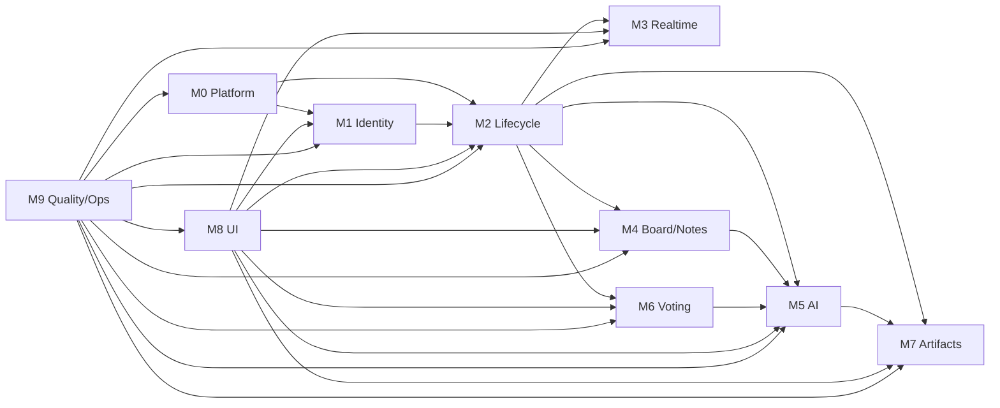

# 모듈 맵

Workshop Agent는 워크샵 준비부터 완료 산출물 운영까지 이어지는 제품이다. 이 문서는 기능을 MECE하게 나누고, 각 모듈의 소유권과 의존성을 고정한다.

## MECE 분류 원칙

1. 한 데이터 테이블은 하나의 주 모듈이 소유한다.
2. 한 API route는 하나의 주 모듈이 소유하되, 인증/응답/검증 공통 모듈을 사용한다.
3. UI 컴포넌트는 화면 도메인 모듈이 소유하고, 범용 UI primitive만 UI 시스템 모듈이 소유한다.
4. 보안, 테스트, 운영은 모든 모듈에 적용되는 교차 관심사지만, 기준과 런북은 M9가 소유한다.
5. 새 기능은 먼저 모듈 소유권을 정한 뒤 schema/API/UI/test/ops 변경 범위를 확정한다.

## 모듈 목록

| ID | 모듈 | 핵심 질문 | 주 산출물 |
|----|------|----------|----------|
| M0 | Platform Foundation | 앱이 안전하게 빌드/실행/배포되는가? | env, clients, Docker, CI |
| M1 | Identity & Access | 이 요청자가 누구이고 무엇을 할 수 있는가? | auth, signed cookie, middleware |
| M2 | Project & Workshop Lifecycle | 어떤 프로젝트/워크샵이 어떤 상태인가? | projects, workshops, settings, stages |
| M3 | Realtime Collaboration | 변경이 모든 참여자에게 어떻게 전파되는가? | channels, presence, reconnect |
| M4 | Board & Notes | 참석자 의견이 어떻게 캡처되고 정규화되는가? | tldraw board, notes |
| M5 | AI Pipeline | AI가 어떤 입력을 어떤 검증된 출력으로 바꾸는가? | prompts, schemas, AI routes |
| M6 | Voting & Prioritization | 무엇이 중요하다고 합의되었는가? | votes, results |
| M7 | Tasks & PRD Artifacts | 워크샵 산출물이 개발 문서로 어떻게 이어지는가? | ax_tasks, prds |
| M8 | UI Experience System | 사용자가 흐름을 이해하고 안전하게 조작하는가? | layout, components, a11y |
| M9 | Quality & Operations | 개발/확장/운영이 반복 가능하고 관측 가능한가? | tests, logs, runbooks |

## 데이터 소유권

| 데이터 | 주 모듈 | 읽는 모듈 | 쓰는 모듈 |
|--------|--------|----------|----------|
| `projects` | M2 | M1, M8, M9 | M2 |
| `workshops` | M2 | M1, M3, M4, M5, M6, M7, M8, M9 | M2, M5 for `is_processing` only |
| `participants` | M1 | M2, M3, M4, M6, M8, M9 | M1 |
| guest session cookie | M1 | M1 | M1 |
| Supabase Auth session | M1 | M1, M2 | M1 |
| `notes` | M4 | M3, M5, M6, M7, M8 | M4, M5 for `cluster_id` assignment only |
| Yjs document | M4 | M3, M4 | M4 |
| `clusters` | M5 | M3, M6, M7, M8 | M5 |
| `votes` | M6 | M3, M5, M7, M8 | M6 |
| `ax_tasks` | M7 | M5, M8 | M5 creates, M7 edits |
| `prds` | M7 | M8, M9 | M7 |
| app logs | M9 | M9 | all modules |

## API 소유권

| API | 주 모듈 | 공통 의존성 |
|-----|--------|-------------|
| `/api/auth/*` | M1 | M0 env, Supabase server client |
| `/api/projects*` | M2 | M1 withFacilitator |
| `/api/workshops*` | M2 | M1 withAuth/withFacilitator |
| `/api/workshops/join` | M1/M2 공동. 세션 발급은 M1, 워크샵 검증은 M2 | M0 env |
| `/api/notes*` | M4 | M1 withAuth, M2 stage lock |
| `/api/clusters*` | M5 | M1, M2 |
| `/api/votes*` | M6 | M1, M2 |
| `/api/tasks*` | M7 | M1, M2 |
| `/api/prd*` | M7 | M1, M2 |
| `/api/ai/cluster` | M5 | M1, M2, M4 |
| `/api/ai/derive` | M5 | M1, M2, M6, M7 |
| `/api/ai/generate` | M5/M7 공동. AI orchestration은 M5, PRD persistence는 M7 | M1, M2 |

## 의존성 방향

허용되는 기본 방향:

금지되는 방향:
- 클라이언트 UI에서 M5 Azure OpenAI client 직접 import 금지.
- M4 board가 M5 clustering prompt/schema를 import 금지.
- M6 voting이 M7 PRD persistence를 직접 수정 금지.
- M8 UI primitive가 도메인 API를 직접 호출 금지.
- M1 session signing이 `SUPABASE_SERVICE_ROLE_KEY`에 의존 금지.

## 확장 가능성 체크

| 영역 | 현재 상태 | 위험 | 보완 작업 |
|------|----------|------|----------|
| 제품 모듈 분리 | 충분히 분리 가능 | 기존 문서는 기능 흐름 중심이라 경계가 흐릴 수 있음 | 이 문서와 `modules/*.md`를 진입점으로 사용 |
| 인증/권한 | 설계는 명확함 | guest cookie와 RLS 경계가 구현 중 흔들릴 수 있음 | M1/M9 테스트를 강하게 작성 |
| 실시간/보드 | 핵심 복잡도 높음 | tldraw/Yjs와 DB 이중 저장 불일치 | M3/M4 계약과 재동기화 테스트 필요 |
| AI 파이프라인 | 서버 전용 원칙 명확 | JSON 실패/잘림/부분 반영 | M5 스키마와 transaction/rollback 필수 |
| 단계 전환 | 흐름 명확 | 각 API가 stage lock을 중복 구현해야 함 | M2에 stage guard helper 추가 |
| UI 확장 | 디자인 원칙 명확 | 화면별 컴포넌트가 커질 수 있음 | M8 primitive와 domain components 분리 |
| 운영 | 기본 방향 있음 | 장애/로그/비용/데이터 보존 런북 부족 | `OPERATIONS.md` 기준으로 보강 |

## 모듈별 완료 정의

각 모듈은 다음이 충족되어야 완료로 본다:
- 소유 데이터와 API가 명확하다.
- Zod 검증과 표준 응답을 사용한다.
- 권한 경계가 `withAuth`/`withFacilitator` 또는 명시된 예외를 통과한다.
- stage write lock이 필요한 경우 API에서 검증한다.
- 최소 단위/통합/컴포넌트 테스트가 있다.
- 운영 로그와 실패 UX가 정의되어 있다.
